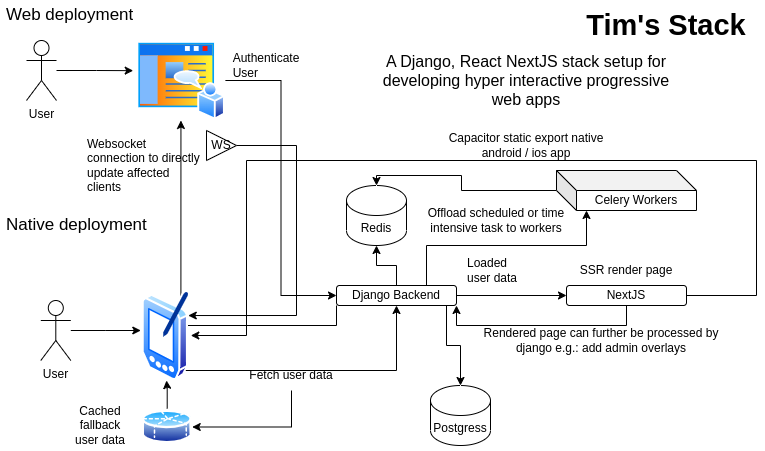

# Tim's Stack: Dynamic cross plattform web app stack

This is a clean rewrite of a stack that I've evolved over the past 2 years. 
It is also my entry to the Bunnyshell hackathon, all components used here have free to use licenses.

## Use Case

This stack is meant for dynamic realtime web apps with mobile clients.
Backend changes can directly be send to clients using a live websocket connection, 
state in the client is managed with redux. 
This allowes automaticly updating all affected clients on any backend changes.

For the web-application setting the django backend dynamicly requests nextjs pages, 
this includes dynamic page data so we get full ssr for all pages.

The nextjs frontend is integrated with capacitor and directly exports to android and ios.
In a native setting the frontend will try to request user data from the backend, 
if it fails it can fallback to a chached version allowing the user to view the full state of the app in an 'offline' mode.

## Stack Components

- nextjs + react frontend (deployment)
    - tailwind + dasyui 
    - automatic plattform adjustments for api calls, authentication and native functions (my custom implementation)
    - global redis store + auto background update websocket
    - capacitor setup for native integrations and ios / android pwa export

- django backend (deployment)
    - celery for tasks management ( or for offloading time intensive tasks )
    - rest_framework + django_rest_dataclasses for rapid REST api development
    - django proxy for authenticating views on other pods like the docs
    - drf_spectacular for autogenerated api documentation
    - django channels for managing websockets and sending update to clinets

- documentation (deployment)
    - pdoc3 code documentation generated from backend code
    
- postgresql (helm chart)
    - main backend database

- redis (helm chart)
    - broker for celery
    - db for django channels
    
## Bunnyshell
    
As this repo uses helm charts you will need either a bunnyshell buissness account or a private cluster to connect to your bunnyshell account.

### Setting-up a private microk8s cluster

As AWS Kubernetes or Google cloud kubernetes servers are quite expensive I prefere to setup a small private cluster running on a 15 euro / mo v-server. Using the right provider this is more than sufficient to run multiple development servers or even a low traffic production deployment.

The helmchart ingress is configured to expose the kubectl api server at `k8s.<your-domain>` we will use this route and given credentials to setup our cluster integration in bunnyshell.

1. install microk8s on server
2. open the port to the kubeapi server and setup dns record `<your-domain> -> server IP` and `k8s.<your-domain> -> server IP`
3. View microk8s client config and copy values to configure bunnyshell cluster 
4. Configure required storage classes ( I've not completed this step ) the following is a comment of the bunnyshell support what you'd need to setup for the cluster the be fully compatible
> TODO insert comment
5. Install cluster issuer and configure ingress to kubeapi server: `microk8s kubectl apply -f configs/ingress.yaml` ( this is used by this chart to connect a host url set by yourself ). Also configure a wildcard dns recod `*.<your-host>` so that later exposed services can be routed to.
    
## Usage
    
This outlines manual usage, for usage with bunnyshell.com check the section above.
    
### Local Development
    
For full local development you have the choice between running the full stack withing `microk8s` locally, or using `docker` and the `Makefile` to run individual components.

#### Microk8s local development

> This is harder to debug but allowes testing microservice interactions

This will spinup the stack configured for local development (`helm/values.yaml`), this is configured to mount directoryies `back/` and `front/` directly into the respecive containers to you will have hot code reloading!

1. setup `microk8s`: `make microk8s_setup`
2. build images and push them to the local microk8s registry: `make full_build_deploy`
3. Install the helm chart: `make helm_install` ( or use `make helm_update` to update an existing chart installation)

> You can switch micrk8s off when your finished with development `microk8s stop`

#### Docker local development

> This is the simples way to develop and debug, but has some differences in local routing strategies

Also mounts `front/` and `back/` directory. It also configures the host route `host.docker.internal:host-gateway` so that containers can interact with each other.

1. Build all images `make full_build`
2. Start all containers `make start_all` ( or start individual ones `make frontend_run`, `make backend_run`, `make start_redis`)

### Production Setup

You can configure any container registry by updating `Makefile` and `helm/values.yaml` I currently like using the github continer registry, the helm chart is setup to authorize pulling images from a github container registry.

You can build all production images **without** any of the production secrets they are only required for the deployed containers. To build all production images use `make full_build_prod` (TODO).

Add your subdomain to the dns recors of mcirok8s
/var/snap/microk8s/current/certs/csr.conf.template

Now you need to authorize your docker installation to push to your private registry, with github container registry you can use `make authorize_github_push gha_token=<your-token>`.

Now you can push the build production images `make push_prod`.

For deployment create a copy of `helm/values.yaml -> heml/production-values.yaml` the choose secure usernames and password for all the services. Now you can install the helm chart on your cluster.

## LICENSE

This project is licensed under the Apache License, Version 2.0 (the "License").
You may not use these files except in compliance with the License.
A copy of the License is included in the "LICENSE" file of this repository or you can also obtain a copy at:

http://www.apache.org/licenses/LICENSE-2.0

Unless required by applicable law or agreed to in writing, software
distributed under the License is distributed on an "AS IS" BASIS,
WITHOUT WARRANTIES OR CONDITIONS OF ANY KIND, either express or implied.
See the License for the specific language governing permissions and
limitations under the License.

## AUTHOR

Tim Schupp (@tbscode) is the author of all other code as marked in the NOTICE section. Attribution is always welcome but not required.

## NOTICE

special custom code written by me (@tbscode) all (Apache 2.0 see LINCENSE section):

- `helm/*` helm chart for deploying all servies, flags configured for deploying only parts of the services
- `Makefile` build and development scripts
- `.github/workflows/*` github actions for building and pushing container images
- `front/pages/_app.js` based mobile layout detector & global state manager.
- `front/utils/tools.tsx` capacitor based env switch and tools for handling streaming requesst to nextjs pages
- `front/components/connection-banner.jsx` Automatic capacitor based plattform detector, manages fetching user_data or falling back to chached user data for offline usage
- `back/core/api/user_data.py` Example api handling core user-data
- `back/core/consumer.py` Simple django-channels consumer to handle client callbacks and update actions
- `config/*` kubernetes configs for preparing private microk8s cluster + bunnyshell setup
- `Dockerfile.*` dockerfile for building all services, builds differ in dev (`_dev`) vs prod

These are the main custom components, other things are just general config's / settings and some scripts.

### libaries used

linked libaries backend (`back/requirements.txt`):

- [`django-cors-headers`](https://github.com/adamchainz/django-cors-headers): [MIT License](https://github.com/adamchainz/django-cors-headers/blob/main/LICENSE)
- [`Python Markdown`](https://github.com/Python-Markdown/markdown): [`BSD-stype`](https://github.com/Python-Markdown/markdown/blob/master/INSTALL.md)
- [`django-filter`](https://github.com/carltongibson/django-filter): [Modified BSD](https://github.com/carltongibson/django-filter/blob/main/LICENSE)
- [`Django`](https://github.com/django/django/tree/main): [BSD 3-Clause](https://github.com/django/django/blob/main/LICENSE)
- [`django-channels`](https://github.com/django/channels/): [BSD 3-Clause](https://github.com/django/channels/blob/main/LICENSE)
- [`django-channels-redis`](https://github.com/django/channels_redis): [BSD 3-clause](https://github.com/django/channels_redis/blob/main/LICENSE)
- [`celery`](https://github.com/celery/celery): [BSD 3-clause](https://github.com/celery/celery/blob/main/LICENSE)
- [`django-celery-results`](https://github.com/celery/django-celery-results): [BSD 3-clause](https://github.com/celery/django-celery-results/blob/main/LICENSE)
- [`django-celery-beat`](https://github.com/celery/django-celery-beat): [BSD 3-clause](https://github.com/celery/django-celery-beat/blob/main/LICENSE)
- [`djangorestframework`](https://www.django-rest-framework.org/): [BSD 3-clause](https://github.com/encode/django-rest-framework/blob/master/LICENSE.md)
- [`djangorestframework-dataclasses`](https://github.com/oxan/djangorestframework-dataclasses): [BSD 3-Clause](https://github.com/oxan/djangorestframework-dataclasses/blob/master/LICENSE)
- [`drf-spectacular`](https://github.com/tfranzel/drf-spectacular/): [BSD 3-Clause](https://github.com/tfranzel/drf-spectacular/blob/master/LICENSE)
- [`django_nextjs`](https://github.com/QueraTeam/django-nextjs): [MIT](https://github.com/QueraTeam/django-nextjs/blob/main/LICENSE)
- [`openai`](https://github.com/openai/openai-python): [MIT](https://github.com/openai/openai-python/blob/main/LICENSE)
- [`ipython`](https://github.com/ipython/ipython): [BSD 3-Clause](https://github.com/ipython/ipython/blob/main/LICENSE)
- [`django-jazzmin`](https://github.com/farridav/django-jazzmin): [MIT](https://github.com/farridav/django-jazzmin/blob/master/LICENSE)
- (only required if connecting to aws postgres db) [`psycopg2-binary`](https://github.com/psycopg/psycopg2): [LGPL](https://github.com/psycopg/psycopg2/blob/master/LICENSE)
- [`uvicorn`](https://github.com/encode/uvicorn): [BSD 3-clause](https://github.com/encode/uvicorn/blob/master/LICENSE.md)
- [`whitenoise`](https://github.com/evansd/whitenoise): [MIT](https://github.com/evansd/whitenoise/blob/main/LICENSE)
- [`jinja2`](https://github.com/pallets/jinja): [BSD 3-clause](https://github.com/pallets/jinja/blob/main/LICENSE.rst)

linked libaries frontend (`front/package.json`):

- [`next.js`](https://github.com/vercel/next.js/): [MIT](https://github.com/vercel/next.js/blob/canary/license.md)
- [`capacitor`](https://github.com/ionic-team/capacitor): [MIT](https://github.com/ionic-team/capacitor/blob/main/LICENSE)
- Capactior plugins: [`preferences (MIT)`](https://github.com/ionic-team/capacitor-plugins/blob/main/preferences/LICENSE)
- [`react`](https://github.com/facebook/react): [MIT](https://github.com/facebook/react/blob/main/LICENSE)
- [`react-dom`](https://github.com/facebook/react/tree/main/packages/react-dom) [MIT (part of react)](https://github.com/facebook/react/blob/main/LICENSE)
- [`dasyui`](https://github.com/saadeghi/daisyui): [MIT](https://github.com/saadeghi/daisyui/blob/master/LICENSE)
- [`eslint`](https://eslint.org/): [MIT](https://github.com/eslint/eslint/blob/main/LICENSE)
- [`eslint-config-next`](https://www.npmjs.com/package/eslint-config-next): [MIT (part of next.js)](https://github.com/vercel/next.js/blob/canary/license.md)
- [`postcss`](https://github.com/postcss/postcss): [MIT](https://github.com/postcss/postcss/blob/main/LICENSE)
- [`tailwindcss`](https://github.com/tailwindlabs/tailwindcss): [MIT](https://github.com/tailwindlabs/tailwindcss/blob/master/LICENSE)
- [`typescript`](https://github.com/microsoft/TypeScript): [Apache 2.0](https://github.com/microsoft/TypeScript/blob/main/LICENSE.txt)

development dependancies:

- [`docker`]()
- [`cmake`]()

runtime dependancies:

- [`python > 3.8`]():
- [`node.js`]()
- [`microk8s`]()

docker images:
