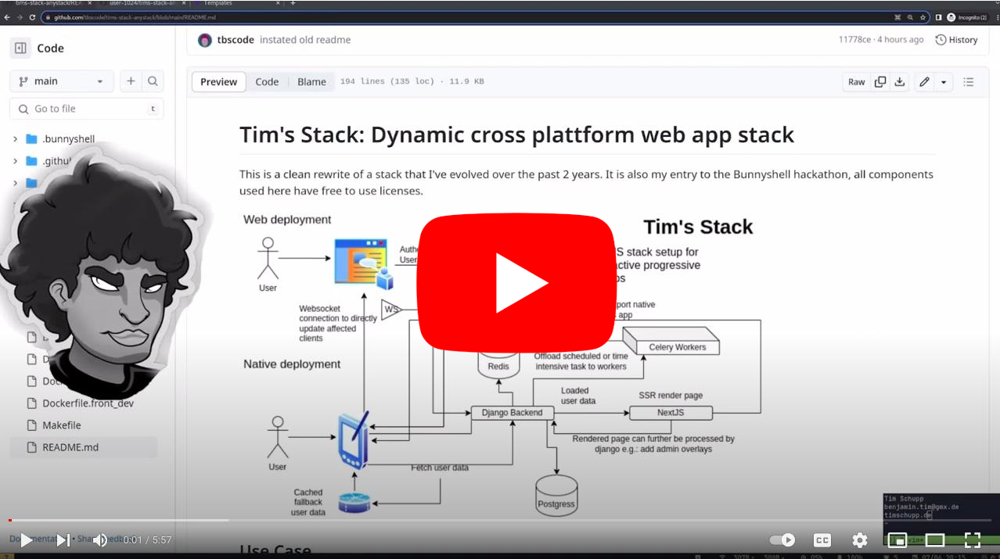

# Tim's Stack: Dynamic Cross-platform Web App Stack

This is a clean rewrite of a stack that I've evolved over the past 2 years.
It is also my entry to the Bunnyshell hackathon, all components used here have free-to-use licenses.

## Use Case

This stack is designed for dynamic real-time web apps with mobile clients.
Backend changes can be directly sent to clients using a live WebSocket connection,
state in the client is managed with Redux.
This allows automatically updating all affected clients on any backend changes.

For the web-application setting, the Django backend dynamically requests Next.js pages,
this includes dynamic page data so we get full SSR for all pages.

The Next.js frontend is integrated with Capacitor and directly exports to Android and iOS.
In a native setting, the frontend will try to request user data from the backend,
if it fails it can fallback to a cached version allowing the user to view the full state of the app in an 'offline' mode.

## Stack Components

- Next.js + React frontend (deployment)
    - Tailwind CSS + DaisyUI
    - Automatic platform adjustments for API calls, authentication, and native functions (my custom implementation)
    - Global Redis store + auto background update WebSocket
    - Capacitor setup for native integrations and iOS / Android PWA export

- Django backend (deployment)
    - Celery for task management (or for offloading time-intensive tasks)
    - Django REST Framework + django_rest_dataclasses for rapid REST API development
    - Django proxy for authenticating views on other pods like the docs
    - DRF Spectacular for auto-generated API documentation
    - Django Channels for managing WebSockets and sending updates to clients

- Documentation (deployment)
    - pdoc3 code documentation generated from backend code

- PostgreSQL (helm chart)
    - Main backend database

- Redis (helm chart)
    - Broker for Celery
    - Database for Django Channels

## Bunnyshell

As this repo uses Helm charts, you will need either a Bunnyshell business account or a private cluster to connect to your Bunnyshell account.

### Demo Video (Compose Template)

#### Demo Video Old (Helm Chart)

### Bunnyshell Templates

There are two templates here:

- [`tims-stack-django-nextjs`](.bunnyshell/templates/tims-stack-django-nextjs/README.md): The stack shown in the demo video, automatically rebuilds backend and frontend images and manages the ingress for your personal domain.
- ~~[`tims-stack-django-nextjs-static`](.bunnyshell/templates/tims-stack-django-nextjs-static/README.md): Same stack as above but uses pre-built images and uses ingress annotation `bns-ingress`~~

> There is not static template. **but even better there is a compose template now**, this can be deployed completely on the bunnyshell cluster, check it here: ``

### Setting up a Private Microk8s Cluster

As AWS Kubernetes or Google Cloud Kubernetes servers are quite expensive, I prefer to set up a small private cluster running on a 15 euro / mo VPS. Using the right provider, this is more than sufficient to run multiple development servers or even a low-traffic production deployment.

The Helm chart ingress is configured to expose the kubectl API server at `k8s.<your-domain>`; we will use this route and given credentials to set up our cluster integration in Bunnyshell.

1. Install Microk8s on the server.
2. Open the port to the kubeapi server and set up DNS records `<your-domain> -> server IP` and `k8s.<your-domain> -> server IP`.
3. View Microk8s client config and copy values to configure Bunnyshell cluster.
4. Configure required storage classes (I've not completed this step) the following is a comment from the Bunnyshell support on what you'd need to set up for the cluster to be fully compatible.
> TODO: Insert comment
5. Install cluster issuer and configure ingress to kubeapi server: `microk8s kubectl apply -f configs/ingress.yaml` (this is used by this chart to connect a host URL set by yourself). Also, configure a wildcard DNS record `*.<your-host>` so that later exposed services can be routed to.

> NOTE: I have not yet managed to correctly set up MetalLB to issue public IP addresses, but with the right configuration, it should be possible to also make this work with the regular bunnyshell-env.com URLs.

## Usage

This section outlines manual usage; for usage with Bunnyshell.com, check the section above.

### Local Development

For full local development, you have the choice between running the full stack within `Microk8s` locally or using `Docker` and the `Makefile` to run individual components.

#### Microk8s Local Development

> This is harder to debug but allows testing microservice interactions

This will spin up the stack configured for local development (`helm/values.yaml`); this is configured to mount directories `back/` and `front/` directly into the respective containers, so you will have hot code reloading!

1. Set up `Microk8s`: `make microk8s_setup`
2. Build images and push them to the local Microk8s registry: `make full_build_deploy`
3. Install the Helm chart: `make helm_install` (or use `make helm_update` to update an existing chart installation)

> You can switch Microk8s off when you're finished with development: `microk8s stop`

#### Docker Local Development

> This is the simplest way to develop and debug but has some differences in local routing strategies

This setup also mounts `front/` and `back/` directories. It configures the host route `host.docker.internal:host-gateway` so that containers can interact with each other.

1. Build all images: `make full_build`
2. Start all containers: `make start_all` (or start individual ones `make frontend_run`, `make backend_run`, `make start_redis`)

### Production Setup

You can configure any container registry by updating `Makefile` and `helm/values.yaml`. I currently like using the GitHub container registry; the Helm chart is set up to authorize pulling images from a GitHub container registry.

You can build all production images **without** any of the production secrets; they are only required for the deployed containers. To build all production images, use `make full_build_prod` (TODO).

Add your subdomain to the DNS records of Microk8s
/var/snap/microk8s/current/certs/csr.conf.template

Now you need to authorize your Docker installation to push to your private registry; with the GitHub container registry, you can use `make authorize_github_push gha_token=<your-token>`.

Now you can push the built production images `make push_prod`.

For deployment, create a copy of `helm/values.yaml -> heml/production-values.yaml`, then choose secure usernames and passwords for all the services. Now you can install the Helm chart on your cluster.

## License

This project is licensed under the Apache License, Version 2.0 (the "License").
You may not use these files except in compliance with the License.
A copy of the License is included in the "LICENSE" file of this repository or you can also obtain a copy at:

http://www.apache.org/licenses/LICENSE-2.0

Unless required by applicable law or agreed to in writing, software
distributed under the License is distributed on an "AS IS" BASIS,
WITHOUT WARRANTIES OR CONDITIONS OF ANY KIND, either express or implied.
See the License for the specific language governing permissions and
limitations under the License.

## Author

Tim Schupp (@tbscode) is the author of all other code as marked in the NOTICE section. Attribution is always welcome but not required.

## Notice

Special custom code written by me (@tbscode), all (Apache 2.0 see LICENSE section):

- `helm/*` Helm chart for deploying all services, flags configured for deploying only parts of the services
- `Makefile` build and development scripts
- `.github/workflows/*` GitHub Actions for building and pushing container images
- `front/pages/_app.js` based on mobile layout detector & global state manager
- `front/utils/tools.tsx` Capacitor-based environment switch and tools for handling streaming requests to Next.js pages
- `front/components/connection-banner.jsx` Automatic Capacitor-based platform detector, manages fetching user_data or falling back to cached user data for offline usage
- `back/core/api/user_data.py` Example API handling core user-data
- `back/core/consumer.py` Simple Django Channels consumer to handle client callbacks and update actions
- `config/*` Kubernetes configs for preparing private Microk8s cluster + Bunnyshell setup
- `Dockerfile.*` Dockerfiles for building all services; builds differ in dev (`_dev`) vs prod

These are the main custom components; other things are just general configs/settings and some scripts.

### Libraries Used

Backend libraries (`back/requirements.txt`):

- [`django-cors-headers`](https://github.com/adamchainz/django-cors-headers): [MIT License](https://github.com/adamchainz/django-cors-headers/blob/main/LICENSE)
- [`Python Markdown`](https://github.com/Python-Markdown/markdown): [`BSD-style`](https://github.com/Python-Markdown/markdown/blob/master/LICENSE)
- [`django-filter`](https://github.com/carltongibson/django-filter): [Modified BSD](https://github.com/carltongibson/django-filter/blob/main/LICENSE)
- [`Django`](https://github.com/django/django/tree/main): [BSD 3-Clause](https://github.com/django/django/blob/main/LICENSE)
- [`django-channels`](https://github.com/django/channels/): [BSD 3-Clause](https://github.com/django/channels/blob/main/LICENSE)
- [`django-channels-redis`](https://github.com/django/channels_redis): [BSD 3-clause](https://github.com/django/channels_redis/blob/main/LICENSE)
- [`celery`](https://github.com/celery/celery): [BSD 3-clause](https://github.com/celery/celery/blob/main/LICENSE)
- [`django-celery-results`](https://github.com/celery/django-celery-results): [BSD 3-clause](https://github.com/celery/django-celery-results/blob/main/LICENSE)
- [`django-celery-beat`](https://github.com/celery/django-celery-beat): [BSD 3-clause](https://github.com/celery/django-celery-beat/blob/main/LICENSE)
- [`djangorestframework`](https://www.django-rest-framework.org/): [BSD 3-clause](https://github.com/encode/django-rest-framework/blob/master/LICENSE.md)
- [`djangorestframework-dataclasses`](https://github.com/oxan/djangorestframework-dataclasses): [BSD 3-Clause](https://github.com/oxan/djangorestframework-dataclasses/blob/master/LICENSE)
- [`drf-spectacular`](https://github.com/tfranzel/drf-spectacular/): [BSD 3-Clause](https://github.com/tfranzel/drf-spectacular/blob/master/LICENSE)
- [`django_nextjs`](https://github.com/QueraTeam/django-nextjs): [MIT](https://github.com/QueraTeam/django-nextjs/blob/main/LICENSE)
- [`openai`](https://github.com/openai/openai-python): [MIT](https://github.com/openai/openai-python/blob/main/LICENSE)
- [`ipython`](https://github.com/ipython/ipython): [BSD 3-Clause](https://github.com/ipython/ipython/blob/main/LICENSE)
- [`django-jazzmin`](https://github.com/farridav/django-jazzmin): [MIT](https://github.com/farridav/django-jazzmin/blob/master/LICENSE)
- (AWS PostgreSQL DB only) [`psycopg2-binary`](https://github.com/psycopg/psycopg2): [LGPL](https://github.com/psycopg/psycopg2/blob/master/LICENSE)
- [`uvicorn`](https://github.com/encode/uvicorn): [BSD 3-clause](https://github.com/encode/uvicorn/blob/master/LICENSE.md)
- [`whitenoise`](https://github.com/evansd/whitenoise): [MIT](https://github.com/evansd/whitenoise/blob/main/LICENSE)
- [`jinja2`](https://github.com/pallets/jinja): [BSD 3-clause](https://github.com/pallets/jinja/blob/main/LICENSE.rst)

Frontend libraries (`front/package.json`):

- [`next.js`](https://github.com/vercel/next.js/): [MIT](https://github.com/vercel/next.js/blob/canary/license.md)
- [`capacitor`](https://github.com/ionic-team/capacitor): [MIT](https://github.com/ionic-team/capacitor/blob/main/LICENSE)
- Capacitor plugins: [`preferences (MIT)`](https://github.com/ionic-team/capacitor-plugins/blob/main/preferences/LICENSE)
- [`react`](https://github.com/facebook/react): [MIT](https://github.com/facebook/react/blob/main/LICENSE)
- [`react-dom`](https://github.com/facebook/react/tree/main/packages/react-dom): [MIT (part of React)](https://github.com/facebook/react/blob/main/LICENSE)
- [`daisyui`](https://github.com/saadeghi/daisyui): [MIT](https://github.com/saadeghi/daisyui/blob/master/LICENSE)
- [`eslint`](https://eslint.org/): [MIT](https://github.com/eslint/eslint/blob/main/LICENSE)
- [`eslint-config-next`](https://www.npmjs.com/package/eslint-config-next): [MIT (part of Next.js)](https://github.com/vercel/next.js/blob/canary/license.md)
- [`postcss`](https://github.com/postcss/postcss): [MIT](https://github.com/postcss/postcss/blob/main/LICENSE)
- [`tailwindcss`](https://github.com/tailwindlabs/tailwindcss): [MIT](https://github.com/tailwindlabs/tailwindcss/blob/master/LICENSE)
- [`typescript`](https://github.com/microsoft/TypeScript): [Apache 2.0](https://github.com/microsoft/TypeScript/blob/main/LICENSE.txt)

Development dependencies:

- [`docker`]()
- [`cmake`]()

Runtime dependencies:

- [`python > 3.8`]():
- [`node.js`]()
- [`microk8s`]()